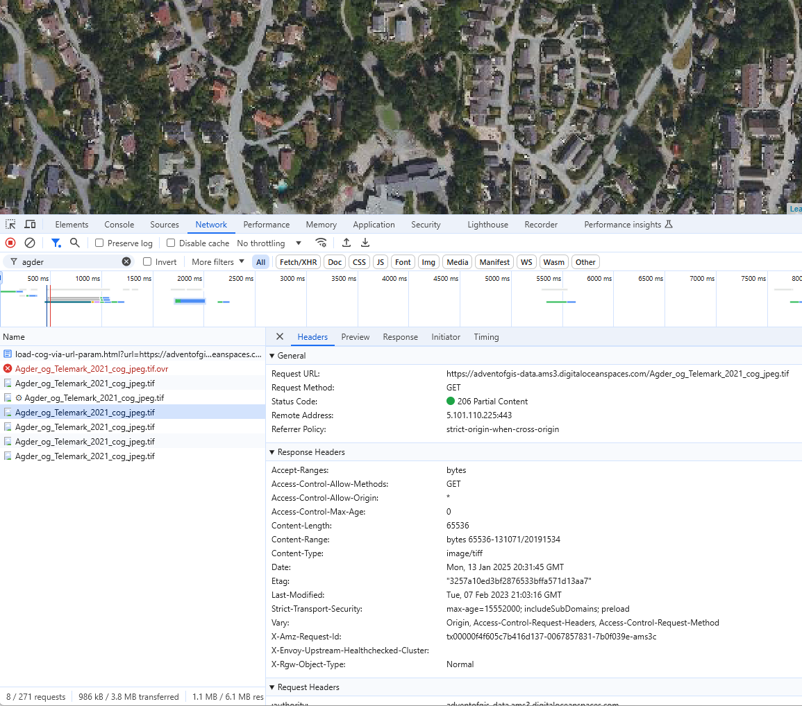

## Innholdsfortegnelse

- [Øvinger - OGC og API-standarder - prøv ut selv!](#øvinger---ogc-og-api-standarder---prøv-ut-selv)
    - [WMS-kall](#wms-kall)
    - [WMTS](#wmts)
    - [XYZ tiles](#xyz-tiles)
    - [Vector Tiles](#vector-tiles)
    - [WFS-kall](#wfs-kall)
    - [OGC-API Features](#ogc-api-features)
    - [Cloud Native Geo-formater](#cloud-native-geo-formater)
    - [WCS](#wcs)

## Øvinger - OGC og API-standarder - prøv ut selv!

### WMS-kall
Prøv ulike requests og responser fra en WMS-tjeneste. Bruk postman, thunderclient eller direkte i nettleser. Du kan bruke disse åpne WMS-tjenestene
```js
# Administrative enheter - kommuner
https://wms.geonorge.no/skwms1/wms.adm_enheter2

# Arealressurs FKB-AR5 (land cover) fra NIBIO
https://wms.nibio.no/cgi-bin/ar5

```

**GetCapabilities**
```js
https://wms.geonorge.no/skwms1/wms.adm_enheter2?service=wms&request=GetCapabilities
```

**Standard getmap-request**

Eksempler på ulike getmap-requests. Prøv med forskjellige parametere. Endre på width/height, ta vekk transparent, endre på DPI. Hvilke layers er gyldige? (hint: GetCapabilities).

(Avansert ekstraoppgave: Støtter tjenestene CQL-filtrering? Klarer du å endre style på layers?)

***FKB WMS (detaljert grunnkart fra Kartverket)***

```js
https://openwms.statkart.no/skwms1/wms.fkb?SERVICE=WMS&VERSION=1.3.0&REQUEST=GetMap&BBOX=887965.7555437539704%2C7997242.274193228222%2C890981.440757751232%2C7999953.436559692957&CRS=EPSG%3A3857&WIDTH=1327&HEIGHT=1193&LAYERS=fkb&STYLES=&FORMAT=image%2Fpng&DPI=96&MAP_RESOLUTION=96&FORMAT_OPTIONS=dpi%3A96&TRANSPARENT=TRUE
```
*URL-parametere for FKB request*

- `SERVICE`: WMS
- `VERSION`: 1.3.0
- `REQUEST`: GetMap
- `BBOX`: 887965.7555437539704,7997242.274193228222,890981.440757751232,7999953.436559692957
- `CRS`: EPSG:3857
- `WIDTH`: 1327
- `HEIGHT`: 1193
- `LAYERS`: fkb
- `STYLES`: 
- `FORMAT`: image/png
- `DPI`: 96
- `MAP_RESOLUTION`: 96
- `FORMAT_OPTIONS`: dpi:96
- `TRANSPARENT`: TRUE

***NIBIO AR5 (arealressurs / land cover)***

```js
https://wms.nibio.no/cgi-bin/ar5?language=nor&SERVICE=WMS&VERSION=1.3.0&REQUEST=GetMap&BBOX=58.95943340262549981%2C9.243950749549400214%2C58.97940439117899558%2C9.257912027381431486&CRS=EPSG%3A4326&WIDTH=834&HEIGHT=1193&LAYERS=AR5&STYLES=&FORMAT=image%2Fpng&DPI=96&MAP_RESOLUTION=96&FORMAT_OPTIONS=dpi%3A96&TRANSPARENT=TRUE
```

*URL-parametere for AR5 request*

- `language`: nor
- `SERVICE`: WMS
- `VERSION`: 1.3.0
- `REQUEST`: GetMap
- `BBOX`: 58.95943340262549981,9.243950749549400214,58.97940439117899558,9.257912027381431486
- `CRS`: EPSG:4326
- `WIDTH`: 834
- `HEIGHT`: 1193
- `LAYERS`: AR5
- `STYLES`: 
- `FORMAT`: image/png
- `DPI`: 96
- `MAP_RESOLUTION`: 96
- `FORMAT_OPTIONS`: dpi:96
- `TRANSPARENT`: TRUE


### WMTS
Prøv ulike requests og responser fra en WMTS-tjeneste. Bruk postman, thunderclient eller direkte i nettleser. Du kan bruke denne åpne WMTS-tjenesten:
```js
// Bakgrunnskart som WMTS fra Kartverket

https://cache.kartverket.no/v1/wmts?

```

**GetCapabilities**
```js
https://cache.kartverket.no/v1/wmts?SERVICE=WMTS&REQUEST=GetCapabilities
```

**Standard getmap-request**

Eksempler på ulike getmap-requests. Prøv med forskjellige parametere.

```js
https://cache.kartverket.no/v1/wmts?SERVICE=WMTS&REQUEST=GetTile&VERSION=1.0.0&LAYER=topo&STYLE=default&FORMAT=image%2Fpng&TILEMATRIXSET=webmercator&TILEMATRIX=15&TILEROW=9844&TILECOL=17113
```

*URL-parametere for WMTS request*
- `SERVICE`: Tjenestetype, her `WMTS`.
- `REQUEST`: Type forespørsel, her `GetTile`.
- `VERSION`: Versjon av WMTS, f.eks. `1.0.0`.
- `LAYER`: Navn på laget som skal vises, her `topo`.
- `STYLE`: Stil som skal brukes, f.eks. `default`.
- `FORMAT`: Format på tilen, f.eks. `image/png`.
- `TILEMATRIXSET`: Tile matrix set, f.eks. `webmercator`.
- `TILEMATRIX`: Zoom-nivå, her `15`.
- `TILEROW`: Rad for tilen, her `9844`.
- `TILECOL`: Kolonne for tilen, her `17113`.


### XYZ tiles
Prøv ulike requests og responser fra en XYZ-tjeneste. Bruk postman, thunderclient eller direkte i nettleser. Prøv ulike {z}, {x} og {y} fra OpenStreetMap sine [åpne tilesets](https://operations.osmfoundation.org/policies/tiles/)
```js
//template: 
https://tile.openstreetmap.org/{zoom}/{x}/{y}.png

//example request:
https://tile.openstreetmap.org/15/17107/9837.png
```

### Vector Tiles
Vector Tiles er kartdata (vektordata) som er optimalisert for akkurat det zoomnivået og tilen. Det sendes tilbake som binærfiler (.pbf). Bruk developer console på https://demotiles.maplibre.org/ for å se eksempler på bruk. 

### WFS-kall
Prøv ulike requests og responser fra en WFS-tjeneste. Bruk postman, thunderclient eller direkte i nettleser. Du kan bruke denne åpne WFS-tjenesten:
```js
//Artskart rødlistearter WFS fra Artsdatabanken
https://kart.artsdatabanken.no/WMS/artskart.aspx?

//Bergede fiskeredskaper (HI)
https://kart.hi.no/data/spokelsesfiske/Bergede_fiskeredskaper/wfs?
```

**GetCapabilities**
```js
https://kart.artsdatabanken.no/WMS/artskart.aspx?version=1.0.0&service=WFS&REQUEST=GetCapabilities
```

**Standard GetFeature-request**

Eksempler på GetFeature-request. Prøv med forskjellige parametere. Kan du endre antall features returnert? Prøv ulike outputFormats som støttes. Hvilke typeNames er gyldige? (hint: GetCapabilities).

(Avansert ekstraoppgave: Støtter tjenestene filtrering?)

```js
https://kart.artsdatabanken.no/WMS/artskart.aspx?SERVICE=WFS&REQUEST=GetFeature&VERSION=2.0.0&TYPENAMES=dwcN:VU_punkt&STARTINDEX=0&COUNT=1000&SRSNAME=urn:ogc:def:crs:EPSG::32633&BBOX=88407.91195784060982987,6464323.65330363810062408,90146.26809692959068343,6465915.75680558755993843,urn:ogc:def:crs:EPSG::32633


https://kart.hi.no/data/spokelsesfiske/Bergede_fiskeredskaper/wfs?SERVICE=WFS&REQUEST=GetFeature&VERSION=2.0.0&TYPENAMES=spokelsesfiske:Bergede_fiskeredskaper&SRSNAME=urn:ogc:def:crs:EPSG::4326&BBOX=58.15960200339408459,8.2788133987817023,58.16281398010017512,8.28744496184315871,urn:ogc:def:crs:EPSG::4326&outputFormat=json
```
### WFS-forespørselsparametere

Når du lager en WFS (Web Feature Service) forespørsel, kan flere parametere brukes for å spesifisere ønskede data og format. Her er noen av de vanligste parameterne:

- `service`: Spesifiserer typen tjeneste. For WFS skal dette være `WFS`.
- `version`: Angir versjonen av WFS-protokollen som skal brukes, for eksempel `1.0.0`, `1.1.0` eller `2.0.0`.
- `request`: Definerer typen forespørsel. Vanlige verdier inkluderer `GetCapabilities`, `DescribeFeatureType` og `GetFeature`.
- `typeNames`: Spesifiserer feature-typen(e) som skal forespørres. Dette er nødvendig for `GetFeature` forespørsler.
- `outputFormat`: Bestemmer formatet på responsen, for eksempel `application/json`, `text/xml` eller `GML`.
- `bbox`: Definerer en bounding box for å begrense det geografiske området for forespørselen. Formatet er `minx,miny,maxx,maxy`.
- `srsName`: Spesifiserer det romlige referansesystemet som skal brukes for responsen, for eksempel `EPSG:4326`.
- `maxFeatures`: Begrenser antall features som returneres i responsen.
- `filter`: Tillater komplekse spørringer ved bruk av OGC Filter Encoding for å spesifisere betingelser på features som skal returneres.
- `propertyName`: Spesifiserer hvilke egenskaper av features som skal inkluderes i responsen.

Disse parameterne hjelper med å tilpasse WFS-forespørselen for å hente de spesifikke geografiske dataene som trengs for ulike applikasjoner og analyser.


### OGC-API Features

Prøv ut OGC-API Features fra tjenesten under. Åpne den direkte i nettleser for HTML-output.
```js
https://api.ra.no/LokaliteterEnkeltminnerOgSikringssoner
```

Prøv med geojson som returformat, bbox filter og større limit

```js
https://api.ra.no/LokaliteterEnkeltminnerOgSikringssoner/collections/enkeltminner/items?bbox=7.9688%2C58.1368%2C8.0380%2C58.1714&limit=1000&offset=0&f=json
```

### Gyldige parametere for en OGC API Features-forespørsel

Når du lager en forespørsel til en OGC API Features-tjeneste, kan du bruke flere parametere for å spesifisere hvilke data du ønsker å hente. Her er noen av de vanligste parameterne:

- **bbox**: Definerer en bounding box for å begrense det geografiske området for forespørselen. Formatet er `minx,miny,maxx,maxy`.
- **limit**: Angir maksimalt antall features som skal returneres i responsen.
- **offset**: Brukes for paginering, angir hvor mange features som skal hoppes over før resultatene returneres.
- **datetime**: Filtrerer features basert på tidsintervaller. Formatet kan være en enkelt tidsverdi eller et tidsintervall.
- **properties**: Spesifiserer hvilke egenskaper av features som skal inkluderes i responsen.
- **sortby**: Angir hvordan resultatene skal sorteres, for eksempel etter en bestemt egenskap.
- **f**: Bestemmer formatet på responsen, for eksempel `json` eller `html`.

Disse parameterne hjelper deg med å tilpasse forespørselen for å hente de spesifikke geografiske dataene du trenger for ulike applikasjoner og analyser.

### Cloud Native Geo-formater
***Cloud Optimized GeoTiff (COGs)***

Prøv ut en COG på linken under. Bruk developer console og se spesielt på "Partial Content". Prøv å last ned originalbildet på url'en under (20mb). COG-innlastingen bruker HTTP Range Requests og laster kun 65.7kb - uten noen servere mellom.

https://geotiff.github.io/georaster-layer-for-leaflet-example/examples/load-cog-via-url-param.html?url=https://adventofgis-data.ams3.digitaloceanspaces.com/Agder_og_Telemark_2021_cog_jpeg.tif

COG-bilde: `https://adventofgis-data.ams3.digitaloceanspaces.com/Agder_og_Telemark_2021_cog_jpeg.tif`




### WCS
Prøv ut WCS-requests med høydemodell fra Kartverket
```js
https://wcs.geonorge.no/skwms1/wcs.hoyde-dom-nhm-25832?SERVICE=WCS&VERSION=1.0.0&REQUEST=GetCoverage&FORMAT=GeoTIFF&COVERAGE=nhm_dom_topo_25832&BBOX=457053,6447058,457574,6447433&CRS=EPSG:25832&RESPONSE_CRS=EPSG:25832&WIDTH=521&HEIGHT=375
```


**Forfatter**

Denne artikkelen er skrevet av Alexander Salveson Nossum (@alexanno), Norkart AS ved hjelp av Github Copilot

