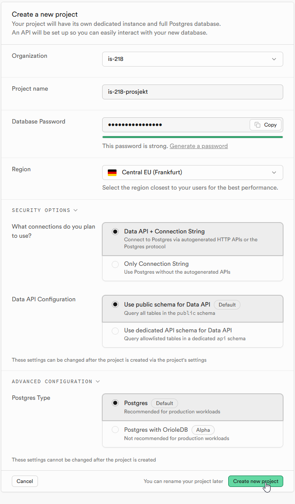
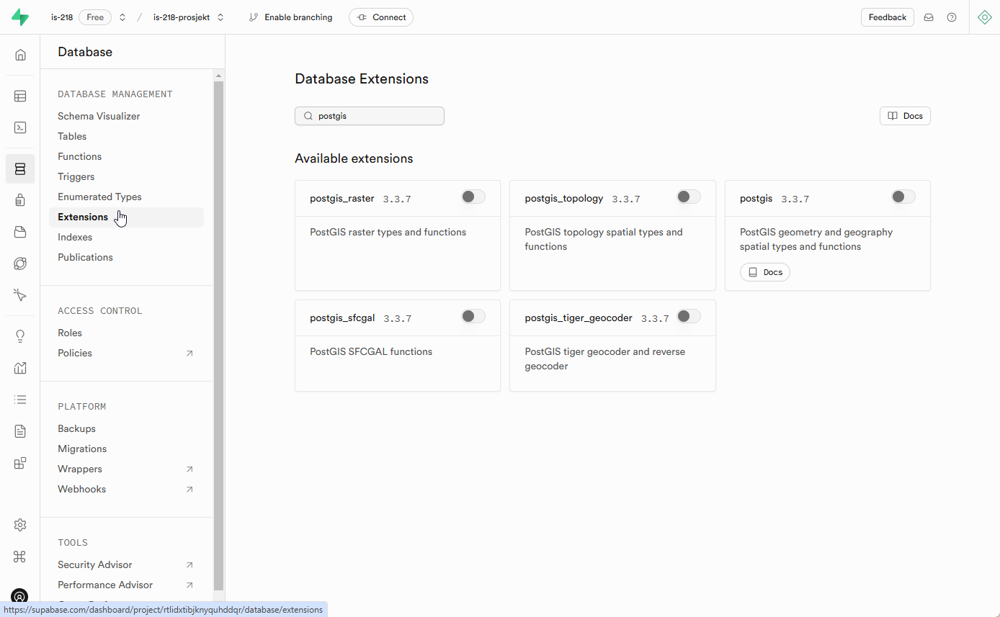
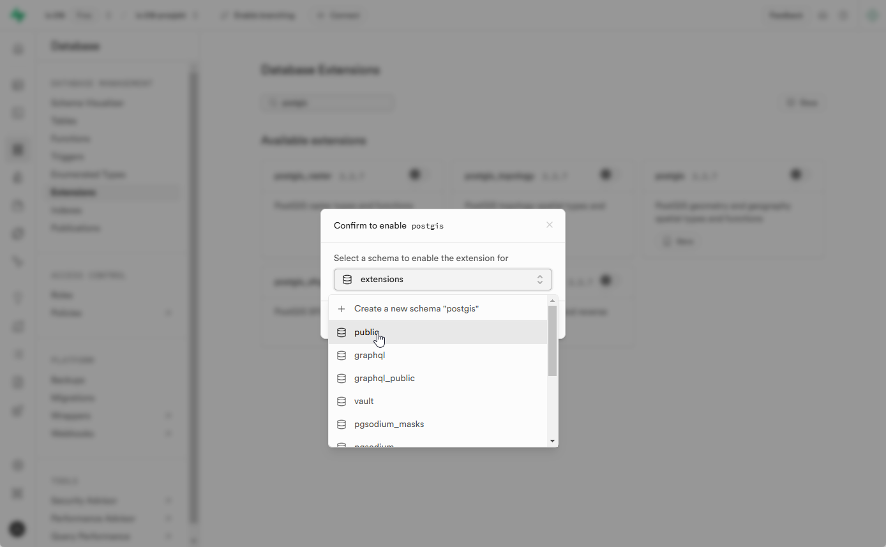
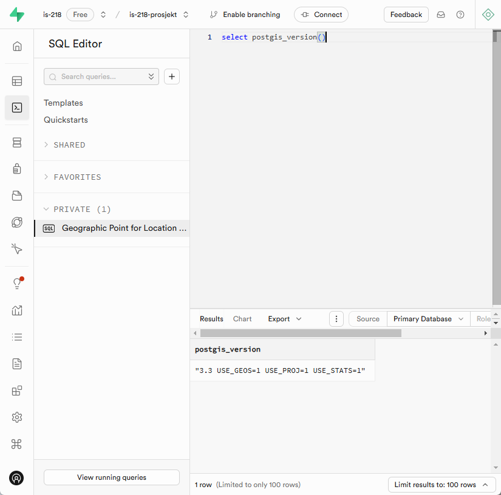
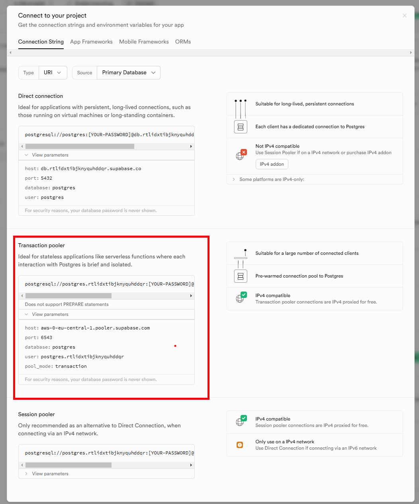

## Opprett konto og oppsett i Supabase
(Se screenshots av prosessen helt i bunnen av filen)
* Lag en ny konto på https://supabase.com/
* Opprett en ny organisasjon og et prosjekt
* Installer postgis som extension i "database"-panelet i Supabase [Dokumentasjon](
https://supabase.com/docs/guides/database/extensions/postgis?queryGroups=language&language=js&queryGroups=database-method&database-method=dashboard)
* Koble til med pgadmin ved å bruke "transaction pooler". [Eksempel](https://supabase.com/docs/guides/database/pgadmin)
* Koble til med qgis ved å legge til en postgis-server

## Oppgaver
Prøv å løs oppgavene under:

* [Advent of GIS - 2024/10](https://github.com/Norkart/AdventOfGIS/blob/2024/10/README.md) - PostGIS
* [Advent of GIS - 2024/11](https://github.com/Norkart/AdventOfGIS/blob/2024/11/README.md) - ST SQL, intersect, area
* [Advent of GIS - 2024/13](https://github.com/Norkart/AdventOfGIS/blob/2024/13/README.md) - Brannkart, PostGIS
* [Advent of GIS - 2024/14](https://github.com/Norkart/AdventOfGIS/blob/2024/14/README.md) - ST SQL, buffer, distance
* [Advent of GIS - 2024/16](https://github.com/Norkart/AdventOfGIS/blob/2024/16/README.md) - PostGIS, KNN
* [Advent of GIS - 2024/18](https://github.com/Norkart/AdventOfGIS/blob/2024/18/README.md) - SQL API

Prøv å lage din egen geojson-sql-api som "edge function" på din Supabase konto
* [Supabase GeoJSON SQL API](https://github.com/alexanno/supabase_geojson_sqlapi)


## Importer eiendommer fra GeoPackage til PostGIS

Bruk følgende `ogr2ogr` kommando for å laste inn et lag (N50_BygningerOgAnlegg_omrade) fra en GeoPackage til en PostGIS-database. Denne kommandoen bruker `pgcopy` for raskere innlasting og viser fremdriften med `-progress`.

```sh
ogr2ogr -f "PostgreSQL" PG:"host=localhost user=your_username dbname=your_dbname password=your_password" \
    /path/to/your/geopackage.gpkg N50_BygningerOgAnlegg_omrade \
    -nln public.N50_BygningerOgAnlegg_omrade -nlt PROMOTE_TO_MULTI -progress -lco GEOMETRY_NAME=geom -lco FID=gid -lco PRECISION=NO -overwrite -skipfailures
```

Erstatt `your_username`, `your_dbname`, `your_password`, og `/path/to/your/geopackage.gpkg` med dine faktiske verdier.

## Eksempelspørringer

Lage et punkt som Geography type
```sql
SELECT ST_Point( 10.73361,59.91193)::geography;
```

Lage en sirkel med 50 meter radius (merk geography gjør at meter fungerer!)
```sql
SELECT ST_Buffer(ST_Point(10.73361,59.91193)::geography, 50);
```

Lag en ny tabell med polygoner i SRID=25833 (utm33) i kolonnen: "geom". INSERT noen sample data. 
```sql
CREATE TABLE spatial_data (
    id SERIAL PRIMARY KEY,
    name VARCHAR(100),
    geom GEOMETRY(POLYGON, 25833)
);

INSERT INTO spatial_data (name, geom) VALUES
('Polygon1', ST_GeomFromText('POLYGON((10 10, 20 10, 20 20, 10 20, 10 10))', 25833)),
('Polygon2', ST_GeomFromText('POLYGON((30 30, 40 30, 40 40, 30 40, 30 30))', 25833));

```

Lag en tabell med punkter i geografiske koordinater (4326=WGS84). Legg til noen tilfeldige punkter.
```sql
CREATE TABLE random_points (
    id SERIAL PRIMARY KEY,
    name VARCHAR(100),
    geom GEOMETRY(POINT, 4326)
);

INSERT INTO random_points (name, geom) VALUES
('RandomPoint1', ST_GeomFromText('POINT(-172.7148268836852 -13.06134847167867)', 4326)),
('RandomPoint2', ST_GeomFromText('POINT(104.61006044568575 89.22728090660212)', 4326)),
('RandomPoint3', ST_GeomFromText('POINT(55.03566637278726 -37.778725159024255)', 4326)),
('RandomPoint4', ST_GeomFromText('POINT(-95.81538906514342 -16.616633984085354)', 4326)),
('RandomPoint5', ST_GeomFromText('POINT(-48.71269838426085 -34.724398531302704)', 4326));
```

Beregn avstanden fra et punkt (POINT(58.005 9.115) til alle punkter i random_points-tabellen. Hva er avstanden målt i? (hint: det blir i grader - ikke meter)
```sql
SELECT name, ST_Distance(geom, ST_GeomFromText('POINT(58.005 9.115)', 4326)) AS distance
FROM random_points
ORDER BY distance;
```

Beregn avstanden fra et punkt (POINT(58.005 9.115)) til alle punkter i random_points-tabellen, og transformerer geometrier til SRID 25833. Merk at avstanden nå blir målt i meter - men krasjer siden punktene er utenfor dekningsområdet til 25833.
```sql
SELECT name, ST_Distance(
    ST_Transform(geom, 25833),
    ST_Transform(ST_GeomFromText('POINT(58.005 9.115)', 4326), 25833)
) AS distance
FROM random_points
ORDER BY distance;
```

Beregn avstanden fra et punkt (POINT(58.005 9.115) til alle punkter i random_points-tabellen. Caster geometrier til "geography"-typen. Avstand blir nå i meter.
```sql
SELECT name, ST_Distance(geometry::geography, ST_GeomFromText('POINT(58.005 9.115)', 4326)::geography) AS distance
FROM random_points
ORDER BY distance
LIMIT 10;
```

Finn alle punktene innenfor 100 meter av en gitt koordinat (POINT(58.005 9.115)).
```sql
SELECT name, geom
FROM random_points
WHERE ST_DWithin(
    geom::geography,
    ST_SetSRID(ST_MakePoint(58.005, 9.115), 4326)::geography,
    100
);
```


Finn de 5 nærmeste punktene til et gitt punkt. Finner nærmeste, uavhengig av avstand. Prøv denne med lite data, med mye data og med spatial index. 
```sql
SELECT name, geom
FROM random_points
ORDER BY geom <-> ST_GeomFromText('POINT(58.005 9.115)', 4326)
LIMIT 5;
```

Lager 1.5 millioner nye punkter i "random_points".
```sql
WITH RECURSIVE generate_series AS (
    SELECT 1 AS id
    UNION ALL
    SELECT id + 1
    FROM generate_series
    WHERE id < 1500000
)
INSERT INTO random_points (name, geom)
SELECT 
    'RandomPoint' || id,
    ST_SetSRID(ST_MakePoint(RANDOM() * 360 - 180, RANDOM() * 180 - 90), 4326)
FROM generate_series;
```

Oppretter en spatial index på "geom"-kolonnen til random_points-tabellen. Bruker GIST-index-algoritmen.
```sql
CREATE INDEX idx_random_points_geometry
ON random_points
USING GIST (geom);
```

Eksempel på geometri-generering. Lager en linje fra en serie med GPS-punkter. 
```sql
SELECT 
    track_id,
    st_makeline(geom) geometri
FROM
    demo.tracking_points
GROUP BY track_id
```


### Arealanalyser - spatial joins and intersects


Finner alle omsetninger (eiendomspunkter) som ligger innenfor 100-metersbelte (strandsone-polygon)
```sql
SELECT o.*
    FROM demo.omsetninger o
    JOIN demo.strandsonen s
    ON st_intersects(o.geom, s.geom)
```


Finner de 5 kommunene med mest myr. 'myr2' er AR50-data for Agder. 'kommuner2' er kommune-polygoner. 
```sql
SELECT 
    k.kommunenavn,
    SUM(ST_Area(m.geom)) AS total_myr_area,
    m.geom
FROM 
    kommuner2 k
JOIN 
    myr2 m
ON 
    ST_Intersects(k.geom, m.geom)
where 
m.objtype='Myr' AND k.fylkesnummer=42
GROUP BY 
    k.kommunenummer, k.kommunenavn,
    m.geom
ORDER BY 
    total_myr_area DESC
LIMIT 1
```

Finn eiendommen med mest myr i areal og lag geometrien som intersecter (intersection).
```sql
SELECT 
    e.eiendom_id,
    e.eiendom_navn,
    ST_Intersection(e.geom, m.geom) AS intersection_geom,
    SUM(ST_Area(ST_Intersection(e.geom, m.geom))) AS total_myr_area
FROM 
    eiendommer e
JOIN 
    myr2 m
ON 
    ST_Intersects(e.geom, m.geom)
WHERE 
    m.objtype = 'Myr'
GROUP BY 
    e.eiendom_id, e.eiendom_navn, e.geom, m.geom
ORDER BY 
    total_myr_area DESC
LIMIT 1;
```


### Clusteranalyse med DBSCAN og Convex Hull (avansert)

Kjør DBSCAN clustering på `random_points` tabellen for å gruppere punkter basert på nærhet. Lager omsluttende geometri med convexhull basert på cluster-tilordningen. 
```sql
WITH clustered_points AS (
    SELECT 
        id,
        name,
        geom,
        ST_ClusterDBSCAN(geom, eps := 1.01, minpoints := 5) OVER () AS cluster_id
    FROM random_points
)

SELECT 
    cluster_id,
    ST_ConvexHull(ST_Collect(geom)) AS geom
FROM clustered_points
WHERE cluster_id IS NOT NULL
GROUP BY cluster_id;
```


**Ressurser**
* https://geopandas.org/en/stable/docs/reference/api/geopandas.read_postgis.html
* https://gdal.org/en/stable/drivers/vector/pg.html
* https://www.crunchydata.com/developers/tutorials
* https://www.crunchydata.com/blog/postgis-for-newbies

## Screenshots til Supabase








