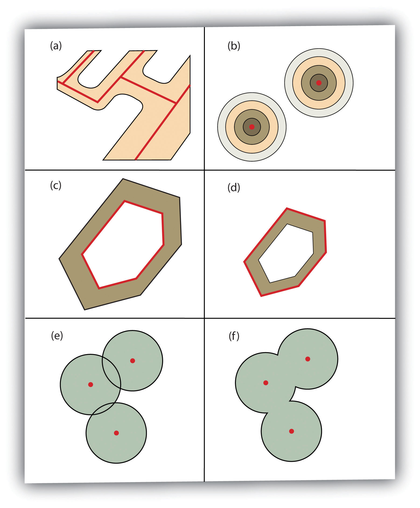

# GIScience: Vektoroperasjoner

## Innholdsfortegnelse
- [Enkeltlagsanalyse](#enkeltlagsanalyse)
    - [Buffer](#buffer)
    - [Geoprosesseringsoperasjoner](#geoprosesseringsoperasjoner)
        - [Dissolve](#dissolve)
        - [Append](#append)
        - [Select](#select)
        - [Merge](#merge)
- [Flerslagsanalyse](#flerslagsanalyse)
    - [Overlagsoperasjoner](#overlagsoperasjoner)
    - [Andre geoprosesseringsmuligheter for flere lag](#andre-geoprosesseringsmuligheter-for-flere-lag)
    - [Concave, Convex Hull](#concave-convex-hull)
    - [Centroid, Center of Mass](#centroid-center-of-mass)
    - [Spatial Joins](#spatial-joins)
    - [Dimensionally Extended 9-Intersection Model (DE9IM)](#dimensionally-extended-9-intersection-model-de9im)

## Enkeltlagsanalyse

### Buffer

Buffring skaper en sone rundt punkter, linjer eller polygoner for å analysere nærhet og influensområder.

**Eksempel på buffer:**


#### PostGIS:

```sql
SELECT ST_Buffer(geom, 1000) AS buffer_geom 
FROM my_geodata;
```

Oppretter en buffer på **1000 meter** rundt alle geometrier i `my_geodata`.

#### GeoPandas:

```python
import geopandas as gpd

gdf = gpd.read_file("my_geodata.shp")
gdf["buffer"] = gdf.geometry.buffer(1000)
```

Lager en buffer på **1000 enheter** rundt geometriene i et GeoDataFrame.

**Tilleggseksempel:**

#### Ulike buffertyper:


- **Variabel breddebuffer (a)**: Bufferbredden varierer basert på en attributtverdi i datasettet. Dette gjør det mulig å ha buffere som er spesifikke for hvert objekt.
- **Flere ringbuffere (b)**: Skaper flere konsentriske buffere rundt et objekt, ofte brukt for å analysere ulike influenssoner.
- **Doughnut-buffer (c)**: En buffer som ekskluderer området inne i det opprinnelige polygonet, nyttig for soner der kun ytre påvirkning er relevant.
- **Setback-buffer (d)**: Bufferen er kun på innsiden av et polygon, ofte brukt i reguleringsplaner.
- **Ikke-oppløst buffer (e)**: Overlappende bufferområder forblir separate og skaper flere distinkte bufferlag.
- **Oppløst buffer (f)**: Overlappende bufferområder smeltes sammen til et enkelt område.

---

### Geoprosesseringsoperasjoner

Geoprosessering brukes til å transformere og analysere vektordata. Her er fire hovedtyper av geoprosesseringsoperasjoner:

#### **Dissolve**

Dissolve brukes til å kombinere polygoner med samme attributtverdi til et enkelt polygon, ofte for å forenkle datasettene.

##### PostGIS:

```sql
SELECT ST_Union(geom) AS dissolved_geom, category 
FROM my_polygons 
GROUP BY category;
```

##### GeoPandas:

```python
dissolved = gdf.dissolve(by="category")
```

#### **Append**

Append slår sammen flere datasett til ett uten å fjerne overlappende geometrier.

##### PostGIS:

```sql
INSERT INTO target_table (geom, attribute) 
SELECT geom, attribute FROM source_table;
```

##### GeoPandas:

```python
appended = gdf1.append(gdf2, ignore_index=True)
```

#### **Select**

Select brukes til å filtrere data basert på spesifikke attributter eller geografiske kriterier.

##### PostGIS:

```sql
SELECT * FROM my_geodata WHERE land_use = 'Residential';
```

##### GeoPandas:

```python
selected = gdf[gdf["land_use"] == "Residential"]
```

#### **Merge**

Merge brukes til å kombinere to datasetter basert på en felles attributt.

##### PostGIS:

```sql
SELECT a.id, a.geom, b.info 
FROM dataset1 a 
JOIN dataset2 b ON a.id = b.id;
```

##### GeoPandas:

```python
merged = gdf1.merge(gdf2, on="id")
```

**Eksempel på enkeltlags-geoprosessering:**

---

## Flerlagsanalyse

### Overlagsoperasjoner
Overlegg kombinerer kartlag for å skape ny informasjon.

**Eksempel på kartoverlegg:**


#### PostGIS:
```sql
-- Finn alle punkter som ligger innenfor et polygon
SELECT p.*
FROM points p, polygons poly
WHERE ST_Contains(poly.geom, p.geom);
```

#### GeoPandas:
```python
points_in_poly = gpd.sjoin(points, polygons, predicate="within")
```
Returnerer alle punkter som ligger **inne** i et polygon.

---

### Andre geoprosesseringsmuligheter for flere lag
Flere avanserte operasjoner for å klippe, slette eller splitte data.

#### PostGIS:
```sql
-- Klipp (Clip) alle veier innenfor et byområde
SELECT ST_Intersection(roads.geom, city.geom) 
FROM roads, city
WHERE ST_Intersects(roads.geom, city.geom);
```

#### GeoPandas:
```python
clipped = gpd.overlay(roads, city, how="intersection")
```
Begrenser `roads`-laget til kun veier **inne i byen**.


### Overlagsoperasjoner
- **Union**: Kombinerer to polygonlag og bevarer alle geometrier og attributter.
- **Intersect**: Bevarer kun overlappende områder mellom to lag.
- **Symmetrical Difference**: Fjerner overlappende områder og beholder kun ikke-overlappende deler.
- **Identity**: Bevarer hele det første laget og legger til overlappende deler fra det andre laget.
- **Clip**: Begrenser geometrier til et definert område.
- **Erase**: Fjerner overlappende områder fra et lag.
- **Split**: Deler et lag inn i flere basert på et annet lags geometri.


**Spatial relationships / overlay methods**


### Concave, Convex Hull

Disse metodene brukes for å beregne den minste polygonen som omslutter et sett med punkter.

- **Convex hull**: Omslutter alle punkter i en konveks form.
- **Concave hull**: Omslutter punktene mer presist, slik at den følger formen bedre.

#### PostGIS:

```sql
-- Convex Hull for et sett med punkter
SELECT ST_ConvexHull(ST_Union(geom)) FROM points;

-- Concave Hull med terskelverdi
SELECT ST_ConcaveHull(ST_Union(geom), 0.8) FROM points;
```

#### GeoPandas
```python
from shapely.ops import unary_union

convex_hull = gdf.unary_union.convex_hull
concave_hull = gdf.unary_union.concave_hull(ratio=0.8)
```


### Centroid, Center of Mass

Disse metodene brukes til å beregne senterpunktet til en geometri.

**Centroid**: Geometrisk sentrum av et objekt.

**Center of Mass (Tyngdepunkt)**: Tar hensyn til formen på objektet.

PostGIS:
```sql
-- Finn centroid av et polygon
SELECT ST_Centroid(geom) FROM polygons;

-- Finn tyngdepunktet (center of mass)
SELECT ST_PointOnSurface(geom) FROM polygons;
```

GeoPandas:
```python
centroid = gdf.geometry.centroid
center_of_mass = gdf.geometry.representative_point()
```
---

### Spatial Joins
Spatial joins kombinerer attributtdata basert på geografisk nærhet eller romlig relasjon.

#### PostGIS:
```sql
-- Finn nærmeste sykehus for hver bygning
SELECT b.id, h.id AS nearest_hospital, 
       ST_Distance(b.geom, h.geom) AS distance
FROM buildings b
JOIN hospitals h 
ON ST_DWithin(b.geom, h.geom, 5000) -- Finn innenfor 5 km
ORDER BY distance;
```

#### GeoPandas:
```python
# Knytter nærmeste sykehus til hver bygning og lagrer distansen.
hospitals_nearest = gpd.sjoin_nearest(buildings, hospitals, distance_col="distance")
```

---


#### **Dimensionally Extended 9-Intersection Model (DE9IM)**

DE9IM er en modell brukt for å beskrive romlige relasjoner mellom geometrier, inkludert forhold som overlapper, tangerer eller er disjunkte. (https://en.wikipedia.org/wiki/DE-9IM)


